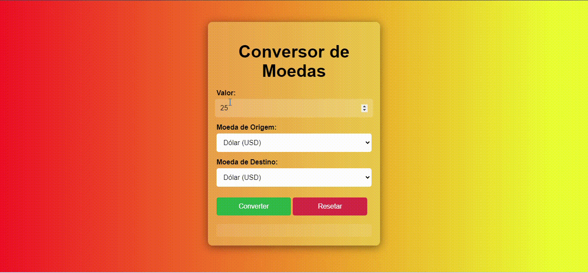

# conversor-simples
Este projeto web simples e intuitivo permite a conversão de diversas moedas de forma rápida e eficiente. A aplicação utiliza JavaScript para realizar os cálculos de conversão e o HTML/CSS para criar a interface do usuário.

## 📝 Introdução
O projeto "Conversor de Moedas" tem como objetivo principal fornecer uma ferramenta simples e eficiente para a conversão de valores monetários entre diversas moedas internacionais. Essa aplicação web permite que usuários realizem cálculos de conversão de forma rápida e precisa, facilitando tarefas como planejamento de viagens, acompanhamento de investimentos e gestão financeira pessoal.

## 📑 Índice
* [Introdução](#introdução)
* [Descrição](#descrição)
* [Arquitetura do Código](#arquitetura-do-código)
* [Responsividade](#responsividade)
* [Funcionamento](#funcionamento)
* [Funcionalidades](#funcionalidades)
* [Técnicas e tecnologias utilizadas](#técnicas-e-tecnologias-utilizadas)
* [Fontes Consultadas](#fontes-consultadas)
* [Colaboradores](#colaboradores)
* [Autor](#autor)

## 🛠️ Descrição
O projeto consiste em um aplicativo web simples e intuitivo que permite aos usuários converter valores monetários entre diversas moedas internacionais. 

- A aplicação oferece uma interface gráfica onde o usuário pode:
    - **Selecionar a moeda de origem:** O usuário escolhe a moeda que deseja converter a partir de um menu dropdown.
    - **Informar o valor:** O usuário insere o valor numérico que deseja converter em um campo de texto.
    - **Selecionar a moeda de destino:** O usuário escolhe a moeda para a qual deseja converter o valor, também a partir de um menu dropdown.
    - **Obter o resultado:** Ao clicar no botão "Converter", o aplicativo realiza o cálculo e exibe o valor convertido na tela.
    - **Resetar os campos:** Um botão "Resetar" permite limpar os campos de entrada e o resultado para uma nova conversão.

### 🏗️ Arquitetura do Código

- **HTML:** Define a estrutura da página, incluindo os elementos do formulário, botões e área de resultado.
- **CSS:** Estiliza a aparência da página, controlando cores, fontes, layout e responsividade.
- **JavaScript:** Realiza a lógica da aplicação, incluindo a obtenção dos valores dos campos de entrada, o cálculo da conversão e a atualização da área de resultado.

### 📱 Responsividade
- **Layout:** O layout da aplicação é responsivo, adaptando-se a diferentes tamanhos de tela. O contêiner principal se ajusta automaticamente à largura disponível.
- **Fontes e tamanhos:** Os tamanhos das fontes e elementos da interface são ajustados para garantir legibilidade em diferentes dispositivos.
- **Espaçamentos:** Os espaçamentos entre os elementos são definidos de forma a manter uma aparência consistente em diferentes resoluções.
- **Botões:** Os botões são dimensionados para ocupar o espaço disponível e possuem um efeito hover para indicar interação.

### ⚙️ Funcionamento
1. **Interface do Usuário:** O usuário interage com a página através de um formulário, selecionando as moedas e informando o valor a ser convertido.
2. **Captura de Dados:** Ao clicar no botão "Converter", o JavaScript captura os valores selecionados pelo usuário nos campos do formulário.
3. **Cálculo da Conversão:** Utilizando as taxas de câmbio pré-definidas em um objeto JavaScript, o código calcula o valor convertido.
4. **Exibição do Resultado:** O resultado da conversão é exibido em uma área específica da página.
5. **Reset:** Ao clicar no botão "Resetar", os campos do formulário são limpos e a área de resultado é zerada, preparando a aplicação para uma nova conversão.

## ✨ Funcionalidades
- **Conversão de moedas:** Permite converter entre diversas moedas populares, como Dólar, Euro, Real, Libra Esterlina, Iene, Dólar Canadense e Dólar Australiano.
- **Interface intuitiva:** A interface é projetada para ser fácil de usar, com campos de entrada claros e um layout organizado.
- **Atualização automática das taxas de câmbio:** As taxas de câmbio são definidas no código JavaScript e podem ser facilmente atualizadas para refletir as taxas de mercado mais recentes.
- **Responsividade:** A aplicação se adapta a diferentes tamanhos de tela, garantindo uma boa experiência do usuário em dispositivos móveis e desktops.

## 📈 Javascript
- O objeto ``exchangeRates`` armazena as taxas de câmbio entre as diferentes moedas. Cada chave do objeto representa uma moeda de origem, e os valores são objetos que mapeiam para as moedas de destino e suas respectivas taxas de câmbio.

- Funcionalidade do JavaScript
    - **Ouvinte de eventos:** Um ouvinte de eventos é adicionado ao formulário para capturar o evento de envio.
    - **Obtenção de valores:** Os valores dos campos de entrada (valor, moeda de origem e moeda de destino) são obtidos.
    - **Cálculo da conversão:** A taxa de câmbio correspondente é obtida do objeto exchangeRates e o valor convertido é calculado.
    - **Atualização da área de resultado:** O resultado da conversão é exibido na área de resultado.
    - **Botão de reset:** Um ouvinte de eventos é adicionado ao botão de reset para limpar os campos de entrada e a área de resultado.

## 🛠️ Técnicas e Tecnologias Utilizadas

* [<code></code>](https://developer.mozilla.org/pt-BR/docs/Web/HTML)
* [<code></code>](https://developer.mozilla.org/pt-BR/docs/Web/CSS)
* [<code></code>](https://developer.mozilla.org/pt-BR/docs/Web/JavaScript)
* [<code></code>](https://git-scm.com/)
* [<code></code>](https://bard.google.com/chat?hl=pt)
* [<code></code>](https://code.visualstudio.com/)
* [<code></code>](https://github.com/)

## 📚 Fontes Consultadas
 
* [Alura - Como escrever um bom README.md](https://www.alura.com.br/artigos/escrever-bom-readme)
* [Bootstrap](https://getbootstrap.com/docs/5.3/forms/checks-radios/#radios)
* [Alura - Tipos de type](https://cursos.alura.com.br/forum/topico-type-do-campo-telefone-104370)
* [Dio](https://www.dio.me/articles/tutorial-criando-um-readme-bonitao-para-o-seu-github)
* [Progamador alternativo - Youtube](https://youtu.be/HJ16WEmOWTw?si=UFvCAtBHbuCc08Hu)
* [Fotos para o subtópico "Técnicas e tecnologias consultadas"](https://github.com/alexandresanlim/Badges4-README.md-Profile)
* [Youtube - TELA DE LOGIN COM TEMA DARK | HTML + CSS](https://youtu.be/69-WfrVBli8?si=GGultNVszQg0wDUK)
* [HomeHost](https://www.homehost.com.br/blog/tutoriais/html-buttton/)
* [W3schools](https://www.w3schools.com/js/js_window_location.asp)

## 🤝 Colaboradores
| [ Fellipe Zanin](https://github.com/Fell1pe) |  [ Ana Luiza](https://github.com/AnaLu1za) |
| :---: | :---: | 

## 👤 Autor
Rafael Souza Mastellini [GitHub](https://github.com/SouzaRafael7)